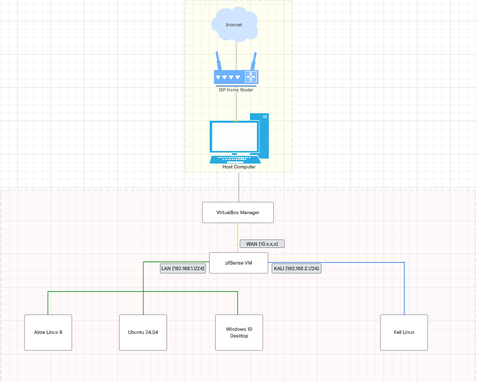

# Home-Lab Project

## Objective

This project involved building a virtual home lab using VirtualBox to simulate a secure enterprise environment with multiple Linux and Windows virtual machines and a pfSense firewall. The goal was to gain hands-on experience with system administration, network configuration, and security monitoring in a controlled, self-managed environment. This lab served as a practical foundation for understanding core cybersecurity concepts and tools.

### Skills Learned

- Resource allocation and performance tuning (CPU, RAM, disk, networking)
- Installing and configuring Linux distros (Ubuntu, Kali, CentOS, etc.)
- Installing and configuring Windows Desktop editions
- IP addressing (static/DHCP), subnetting, and routing
- Installing and configuring pfSense as a virtual firewall/router
- Development of critical thinking and problem-solving skills in cybersecurity.

### 🖥️ Virtual Machines Used

| VM               | Purpose                        |
|------------------|--------------------------------|
| pfSense VM       | Firewall/router                |
| Windows 10 VM    | Workstation (LAN)              |
| Ubunutu 24.04 VM | Workstation (LAN)              |
| AlmaLinux 9 VM   | Workstation (LAN)              |
| Kali Linux VM    | Isolated attacker VM (DMZ)     |

---

## Network Architecture

---

## VM Configuration in VirtualBox

### pfSense VM

- **Adapter 1**: Bridged (for WAN/internet access)
- **Adapter 2**: Internal Network (`pfsense-lan`) — LAN side for Windows/Linux VMs
- **Adapter 3**: Internal Network (`pfsense-kali`) — isolated Kali subnet

### Windows + AlmaLinux + Ubuntu (LAN VMs)

- **Adapter 1**: Internal Network (`pfsense-lan`)

### Kali Linux VM

- **Adapter 1**: Internal Network (`pfsense-kali`)

---

## pfSense Configuration

### Interfaces

- **WAN**: DHCP from Bridged adapter
- **LAN**:
  - Static IP: `192.168.1.1/24`
  - DHCP enabled: `192.168.1.100–192.168.1.200`
- **KALI**:
  - Static IP: `192.168.2.1/24`
  - DHCP enabled: `192.168.2.100–192.168.2.110`

---

## Outbound NAT
- Go to **Firewall → NAT → Outbound**
- Set mode to **Hybrid Outbound NAT**
- Add a rule:
  - **Interface**: WAN
  - **Source**: `192.168.2.0/24`
  - **Translation**: WAN subnet
 
---

## Firewall Rules

### LAN Interface

- **Allow all LAN traffic**:
  - Source: `LAN subnet`
  - Destination: `any`
  - Action: Pass

### KALI Interface

- **Block KALI from accessing LAN**:
  - Source: `KALI subnet`
  - Destination: `192.168.1.0/24`
  - Action: Block

- **Allow all other KALI traffic**:
  - Source: `KALI subnet`
  - Destination: `any`
  - Action: Pass

---

# Challenges

- I had a difficult time fully connecting the Kali to the internet. It was getting an IP assigned to it by the pfSense firewall and the firewall could ping the Kali VM; however, the Kali VM could not ping google or ping the firewall. I tried many different solutions, mostly involving tuning the firewall rules and ensuring NAT was configured correctly. In the end, I discovered the iptables firewall rules I configured on the Kali VM ages ago was blocking the traffic from getting through to the firewall.

# Future Enhancements
- Adjust firewall rules to allow Kali traffic through to the LAN for penetration testing activities
- Install and configure Suricata on the pfSense VM
